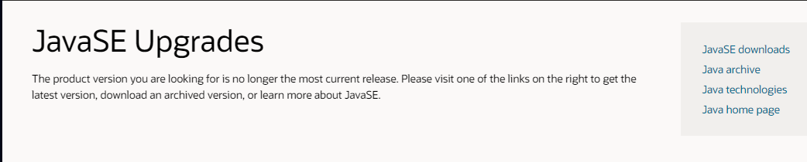

# Apartado 3P que habla del proceso de instalacíon/configuracíon del lenguaje `java`

> Pincha [aquí](https://www.oracle.com/java/technologies/javase/upgrade.html) para acceder a la descarga de la version de `java`a instalar.  

Verás un menu a la dercha, pincha en [**`java downloads`**](https://www.oracle.com/java/technologies/)

> Irás hasta:  

> Aquí debes escoger version y plataforma  
